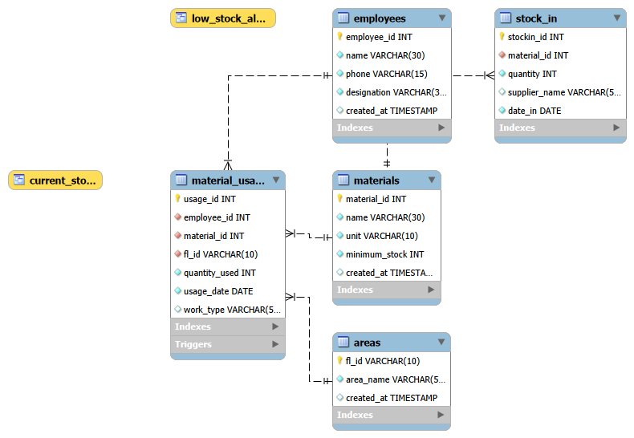
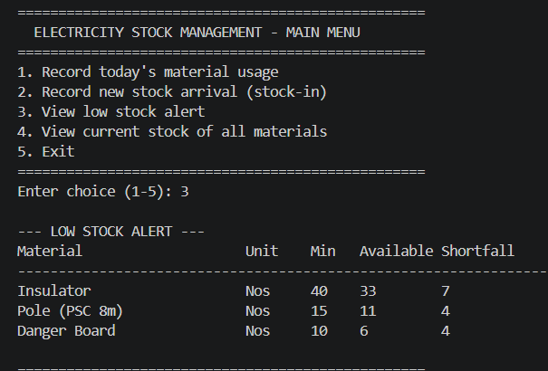
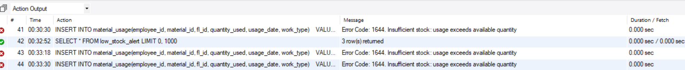
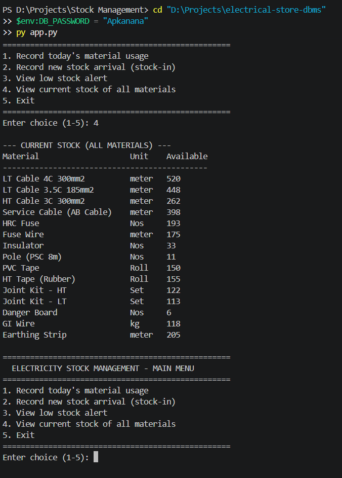
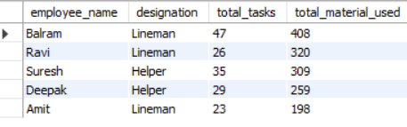

# Electricity Material Stock Management System

A relational database system to track material inventory, usage, and stock movement
across operational areas for an electricity distribution utility — inspired by
real-world inventory challenges observed during a data internship at BSES Rajdhani
Power Limited.

## Problem Statement
Field teams (linemen, helpers) consume materials like cables, fuses, insulators,
poles, and joint kits across different areas daily. Without a tracking system,
it's hard to know:
- What stock is currently available
- Which materials are running low and need reordering
- Which area/employee is consuming the most material
- Whether recorded usage is even physically possible (data integrity)

This project solves that with a normalized MySQL schema, automated views, a
trigger for data integrity, realistic bulk sample data, and a Python CLI
application layer so field staff don't need to write SQL.

## Tech Stack
- MySQL 8.0 (DDL, DML, Views, Triggers)
- Python 3 (`mysql-connector-python`) — CLI application layer

## Database Design
5 tables, 4 foreign-key relationships:

- `employees` — field staff (linemen, helpers)
- `materials` — 15 real inventory items (LT/HT cables, fuses, insulators,
  poles, joint kits, tapes, etc.) with minimum stock thresholds
- `areas` — feeder locations (fl_id based)
- `stock_in` — incoming stock records with supplier tracking
- `material_usage` — material consumed per employee, per area, per task



## Key Features
- **`current_stock` view** — real-time available quantity per material
  (total stock in − total used), no manual calculation needed
- **`low_stock_alert` view** — auto-flags materials below minimum threshold
- **Trigger (`before_material_usage_insert`)** — blocks any usage entry that
  would push stock negative, enforcing data integrity at the database level
- **7 reporting queries** — area-wise consumption, employee performance,
  monthly trends, work-type analysis (see `queries.sql`)
- **Python CLI app (`app.py`)** — lets non-SQL-literate field staff record
  usage/stock via a simple numbered menu; the app safely relies on the
  database trigger to reject invalid entries

## How to Run the Database
```bash
mysql -u root -p < schema.sql
mysql -u root -p < sample_data.sql
mysql -u root -p < views_triggers.sql
mysql -u root -p < queries.sql
```
Or run each file in order inside MySQL Workbench.

## How to Run the Python App

The app reads your MySQL password from an environment variable, so it is
never hardcoded or committed to source control.

**Windows (PowerShell):**
```powershell
$env:DB_PASSWORD = "your_mysql_password"
py app.py
```

**macOS/Linux:**
```bash
export DB_PASSWORD="your_mysql_password"
python3 app.py
```

You'll see a menu to record usage, record stock arrivals, view low-stock
alerts, and view current stock — no SQL required.

## Sample Output

**Low stock alert:**


**Trigger rejecting an invalid entry (data integrity in action):**


**Python CLI in action:**


**Employee-wise usage report:**


## Future Improvements
- Web-based dashboard (Streamlit) so field staff can use a browser form
  instead of a terminal
- REST API layer for stock-in and usage entry
- Email/SMS alert automation on low stock

## Author
Shivam Kumar Sah — [GitHub](https://github.com/Shivam-Kumar-sah)
